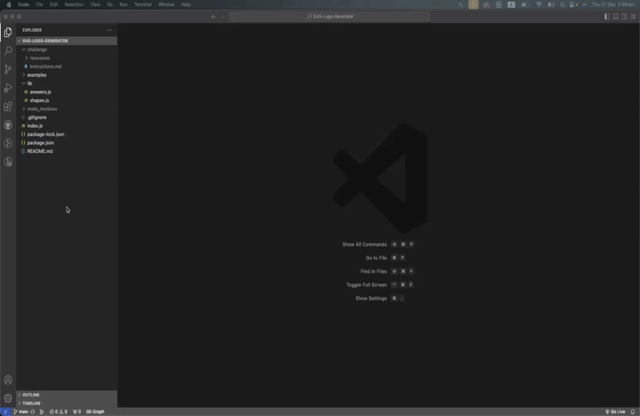

# SVG-Logo-Generator

## Description

Create a customizable logo effortlessly with my SVG Logo Generator. Being able to customized the text (1-3 Characters long), choose a shape (Square, Circle, & Triangle), and pick a text & shape color of your choice!

## User Story
AS a freelance web developer
I WANT to generate a simple logo for my projects
SO THAT I don't have to pay a graphic designer

## Table of Contents

- [Installation](#installation)
- [Usage](#usage)
- [Credits](#credits)
- [License](#license)
- [Features](#features)
- [Contribution](#contribution)
- [Tests](#tests)
- [Questions](#questions)

## Installation

Make sure to have NodeJS, NPM, and Inquirer @ 8.2.4 installed to use the application.

## Usage

<video src="assets/SVG_tutorial.mp4" controls title="Title"></video>

## Credits

I have rewatched my pre-recorded classes of learning OOP (Object Oriented Programming) and used the activities in the UCSD (Univiersity of California San Diego) OOP folder section to help me with this project.

## License

This project is under no license.

## Features

Interactive Command-line Interface

- User-friendly command-line interface: Guides users through the process of providing information. Use clear prompts and concise instructions.

- Customization: Choose from a variety of shapes, colors, and fonts to personalize your logo.

- Scalable Vector Graphics (SVG): Generate logos in SVG format for high-quality and scalable graphics.

## How to Contribute?

Feel free to test out my SVG Logo Generator, and give any feedback on how I can improve it.

## Tests

For users to test out this SVG Logo Generator.

## Questions

If you have any questions, please contact me at businesswawj@gmail.com.
You can also visit my GitHub page at https://github.com/lifewawj.
